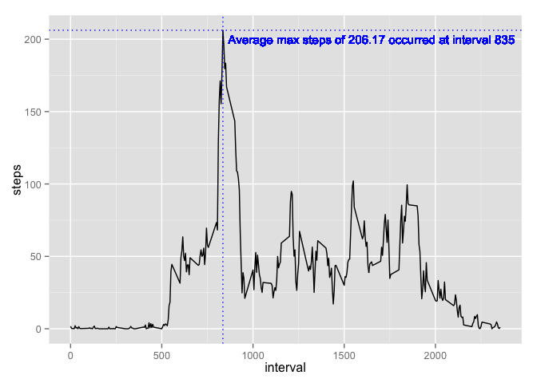
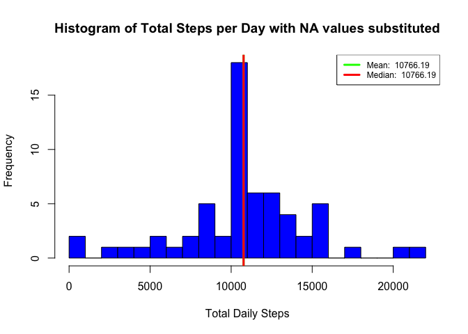

# PA1_template
Johnny Vargas (SpaceMan51)  
Thursday, June 11, 2015  

### Assignment Info:
This assignment makes use of data from a personal activity monitoring device. This device collects data at 5 minute intervals through out the day. The data consists of two months of data from an anonymous individual collected during the months of October and November, 2012 and include the number of steps taken in 5 minute intervals each day.

This assignment will be described in multiple parts. Each part is identified below with a description, the R code, and any accompanying plots. 

### Reference:
Peer Assessment #1, Reproducible Research

### Data and Variables:
The data for this assignment can be downloaded from the course web site:

Dataset: [Activity monitoring data](https://d396qusza40orc.cloudfront.net/repdata%2Fdata%2Factivity.zip)  
Unzip the dataset and save to working directory.

Variables:
The variables included in this dataset are:

* Steps: Number of steps taking in a 5-minute interval (missing values are coded as NA)
* Date: The date on which the measurement was taken in YYYY-MM-DD format
* Interval: Identifier for the 5-minute interval in which measurement was taken

The dataset is stored in a comma-separated-value (CSV) file and there are a total of 17,568 observations in this dataset.

#### Load required libraries

```r
library(ggplot2)
```

#### I. Loading and preprocessing the data
Show any code that is needed to

1. Load the data (i.e. read.csv())
2. Process/transform the data (if necessary) into a format suitable for your analysis


```r
# Load the data
# This code requires that the raw data file exist in the working directory
# No additional pre-processing is required for the first few steps other than ensuring to load with header and sep options
unzip("activity.zip")
activity <- read.csv(file="activity.csv", header=TRUE, sep=",")
```

#### II. What is mean total number of steps taken per day?

For this part of the assignment, you can ignore the missing values in the dataset.

1. Calculate the total number of steps taken per day
2. If you do not understand the difference between a histogram and a barplot, research the difference between them. Make a histogram of the total number of steps taken each day
3. Calculate and report the mean and median of the total number of steps taken per day


```r
## aggregate total steps by day into new data frame
daily_steptotals <- aggregate(activity$steps, list(date = activity$date), FUN=sum, na.rm=TRUE)
## rename x to steps
names(daily_steptotals)[names(daily_steptotals)=="x"] <- "steps"

hist(daily_steptotals$steps, breaks = 20, main="Histogram of Total Steps per Day (breaks=20)", col="blue", xlab="Total Daily Steps")

mean_dailysteps <- mean(daily_steptotals$steps)
median_dailysteps <- median(daily_steptotals$steps)

mean_message <- paste("Mean steps:", format(round(mean_dailysteps, 2)))
median_message <- paste("Median steps:", format(round(median_dailysteps, 2)))

print(mean_message)
```

```
## [1] "Mean steps: 9354.23"
```

```r
print(median_message)
```

```
## [1] "Median steps: 10395"
```

```r
abline(v=mean_dailysteps, lwd = 3, col = 'green')
abline(v=median_dailysteps, lwd = 3, col = 'red')
legend('topright', cex = .75, lty = 1, lwd = 3, col = c("green", "red"),  
       legend = c(paste('Mean: ', mean_dailysteps),
                  paste('Median: ', median_dailysteps))
)
```

 

#### III. What is the average daily activity pattern?

1. Make a time series plot (i.e. type = "l") of the 5-minute interval (x-axis) and the average number of steps taken, averaged across all days (y-axis)
2. Which 5-minute interval, on average across all the days in the dataset, contains the maximum number of steps?


```r
## factorize year (in order to find mean per factor (interval))
activity_factorized <- transform(activity, interval = factor(interval))
## collapse dataset down to average values per interval
activity_dailyavg_byinterval <- aggregate(activity_factorized[, "steps"], 
                                list(activity_factorized$interval), mean, na.rm=TRUE)
## rename x to steps (aggregating creates column as x )
names(activity_dailyavg_byinterval)[names(activity_dailyavg_byinterval)=="x"] <- "steps"
## rename Group.1 to interval (aggregating creates column as Group.1)
names(activity_dailyavg_byinterval)[names(activity_dailyavg_byinterval)=="Group.1"] <- "interval"

## convert interval back to numeric (we factorized in order to find average per interval)
activity_dailyavg_byinterval <- transform(activity_dailyavg_byinterval, 
                                          interval = as.integer(as.character(interval)))

## plot to observe trend and average max steps
Max_steps = activity_dailyavg_byinterval[which.max(activity_dailyavg_byinterval$steps), ]
max_steps_annotate <- paste("Average max steps of", format(round(Max_steps$steps, 2)), "occurred at interval", Max_steps$interval)

p <- ggplot(activity_dailyavg_byinterval, aes(interval, steps))
p + geom_line() + 
        geom_hline(yintercept = max(activity_dailyavg_byinterval$steps), color="blue", linetype="dotted") + 
        geom_text(x = 1650, y = 200, color = "blue", label = max_steps_annotate, size=4) +
        geom_vline(xintercept = Max_steps$interval, color = "blue", linetype="dotted")
```

 

```r
print(max_steps_annotate)
```

```
## [1] "Average max steps of 206.17 occurred at interval 835"
```

#### IV. Imputing missing values

Note that there are a number of days/intervals where there are missing values (coded as NA). The presence of missing days may introduce bias into some calculations or summaries of the data.

1. Calculate and report the total number of missing values in the dataset (i.e. the total number of rows with NAs)


```r
summary(activity)
```

```
##      steps                date          interval     
##  Min.   :  0.00   2012-10-01:  288   Min.   :   0.0  
##  1st Qu.:  0.00   2012-10-02:  288   1st Qu.: 588.8  
##  Median :  0.00   2012-10-03:  288   Median :1177.5  
##  Mean   : 37.38   2012-10-04:  288   Mean   :1177.5  
##  3rd Qu.: 12.00   2012-10-05:  288   3rd Qu.:1766.2  
##  Max.   :806.00   2012-10-06:  288   Max.   :2355.0  
##  NA's   :2304     (Other)   :15840
```

```r
na_count <- sum(is.na(activity$steps))
na_count_message <- paste("There are", na_count, "NA values in the original dataset")
print(na_count_message)
```

```
## [1] "There are 2304 NA values in the original dataset"
```

2. Devise a strategy for filling in all of the missing values in the dataset. The strategy does not need to be sophisticated. For example, you could use the mean/median for that day, or the mean for that 5-minute interval, etc.

##### Strategy for filling in missing values in the original dataset is to use the average number of steps for that specific interval. This strategy will be used to fill-in the missing data using the average value for that specific interval anywhere there is a NA in the original dataset.  The pseudo-code is that for every row in the raw dataset, if the row has NA as the value for "steps" then the "steps" value for that "interval" from the mean value dataset will be used to substitute into the original dataset (the one with NA values). The result will be a dataset without NA values and all previous NA values will be equal to the mean value for that interval across the entire dataset.

3. Create a new dataset that is equal to the original dataset but with the missing data filled in.

```r
## original dataset is named "activity"
## dataset with average values is named "activity_dailyavg_byinterval"
## the average values from "activity_dailyavg_byinterval" will be used to fill in the NA values in "activity"
str(activity_dailyavg_byinterval)
```

```
## 'data.frame':	288 obs. of  2 variables:
##  $ interval: int  0 5 10 15 20 25 30 35 40 45 ...
##  $ steps   : num  1.717 0.3396 0.1321 0.1509 0.0755 ...
```

```r
na_countmean <- sum(is.na(activity_dailyavg_byinterval$steps))
na_countmean_message <- paste("There are", na_countmean, "NA values in the mean value dataset")
print(na_countmean_message)
```

```
## [1] "There are 0 NA values in the mean value dataset"
```

```r
##Create new data.frame "activity_noNA" as a copy of "activity" data frame. This new copy will serve as the data frame that will have its NA values replaced with the average values from "activity_dailyavg_byinterval"
## fill in missing values
activity_noNA <- activity
for (i in 1:nrow(activity_noNA)) { 
        if(is.na(activity_noNA[i,"steps"])) {
                interval <- activity_noNA[i,"interval"]
                fill_val <- activity_dailyavg_byinterval[activity_dailyavg_byinterval$interval == interval, "steps"]
                activity_noNA[i,"steps"] <- fill_val
        }
}

na_countnoNA <- sum(is.na(activity_noNA$steps))
na_countnoNA_message <- paste("There are", na_countnoNA, "NA values in the new dataset")
print(na_countnoNA_message)
```

```
## [1] "There are 0 NA values in the new dataset"
```

4. Make a histogram of the total number of steps taken each day and Calculate and report the mean and median total number of steps taken per day. Do these values differ from the estimates from the first part of the assignment? What is the impact of imputing missing data on the estimates of the total daily number of steps?


```r
## aggregate total steps by day into new data frame
newdaily_steptotals <- aggregate(activity_noNA$steps, list(date = activity_noNA$date), FUN=sum, na.rm=TRUE)
## rename x to steps
names(newdaily_steptotals)[names(newdaily_steptotals)=="x"] <- "steps"

hist(newdaily_steptotals$steps, breaks = 20, main="Histogram of Total Steps per Day with NA values substituted", col="blue", xlab="Total Daily Steps")

newmean_dailysteps <- mean(newdaily_steptotals$steps)
newmedian_dailysteps <- median(newdaily_steptotals$steps)

newmean_message <- paste("Mean steps:", format(round(newmean_dailysteps, 2)))
newmedian_message <- paste("Median steps:", format(round(newmedian_dailysteps, 2)))

print(newmean_message)
```

```
## [1] "Mean steps: 10766.19"
```

```r
print(newmedian_message)
```

```
## [1] "Median steps: 10766.19"
```

```r
abline(v=newmean_dailysteps, lwd = 3, col = 'green')
abline(v=newmedian_dailysteps, lwd = 3, col = 'red')
legend('topright', cex = .75, lty = 1, lwd = 3, col = c("green", "red"),  
       legend = c(paste('Mean: ', format(round(newmean_dailysteps, 2))),
                  paste('Median: ', format(round(newmedian_dailysteps, 2))))
)
```

 

```r
meandiff <- mean_dailysteps - newmean_dailysteps
mediandiff <- median_dailysteps - newmedian_dailysteps

meandiff_message1 <- paste("The original mean was:", format(round(mean_dailysteps, 2)))
meandiff_message2 <- paste("The new mean after substituting NA values is:", format(round(newmean_dailysteps, 2)))
meandiff_message3 <- paste("The difference between original mean and new mean is:", format(round(meandiff, 2)))
print(meandiff_message1)
```

```
## [1] "The original mean was: 9354.23"
```

```r
print(meandiff_message2)
```

```
## [1] "The new mean after substituting NA values is: 10766.19"
```

```r
print(meandiff_message3)
```

```
## [1] "The difference between original mean and new mean is: -1411.96"
```

```r
mediandiff_message1 <- paste("The original median was:", format(round(median_dailysteps, 2)))
mediandiff_message2 <- paste("The new median after substituting NA values is:", format(round(newmedian_dailysteps, 2)))
mediandiff_message3 <- paste("The difference between original median and new median is:", format(round(mediandiff, 2)))
print(mediandiff_message1)
```

```
## [1] "The original median was: 10395"
```

```r
print(mediandiff_message2)
```

```
## [1] "The new median after substituting NA values is: 10766.19"
```

```r
print(mediandiff_message3)
```

```
## [1] "The difference between original median and new median is: -371.19"
```

#### V. Are there differences in activity patterns between weekdays and weekends?

For this part the weekdays() function may be of some help here. Use the dataset with the filled-in missing values for this part.

1. Create a new factor variable in the dataset with two levels - "weekday" and "weekend" indicating whether a given date is a weekday or weekend day.
2. Make a panel plot containing a time series plot (i.e. type = "l") of the 5-minute interval (x-axis) and the average number of steps taken, averaged across all weekday days or weekend days (y-axis). See the README file in the GitHub repository to see an example of what this plot should look like using simulated data.


```r
## add new column and identify as weekday vs weekend
activity_noNA$weekday <- ifelse(weekdays(as.Date(activity_noNA$date)) %in% c("Saturday", "Sunday"), "weekend", "weekday")
## factorize weekday into factor with 2 levels "weekday" and "weekend"
activity_noNA <- transform(activity_noNA, weekday = factor(weekday))
## aggregate by interval for weekdays and weekends
activity_noNA_intervalavgbyweekend <- aggregate(steps ~ interval + weekday, data=activity_noNA, mean)
## plot in facet plot showing comparison of weekday vs weekend interval averages
ggplot(activity_noNA_intervalavgbyweekend, aes(interval, steps, color=weekday)) + geom_line() + facet_grid(weekday ~ .) + xlab("Interval") + ylab("Average Number of Steps") + guides(color=FALSE)
```

 
